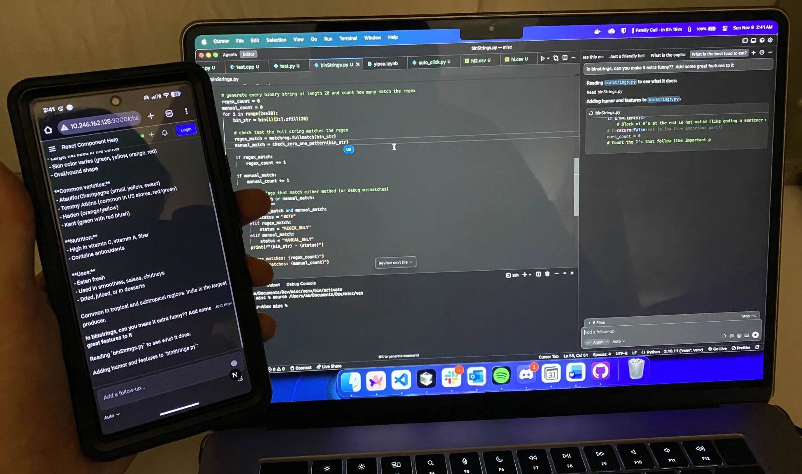
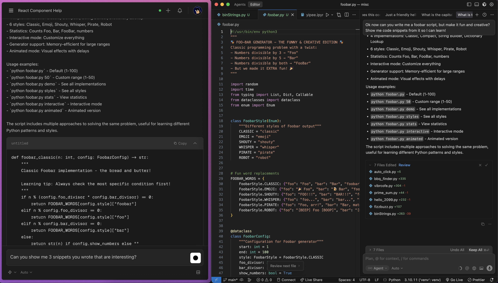
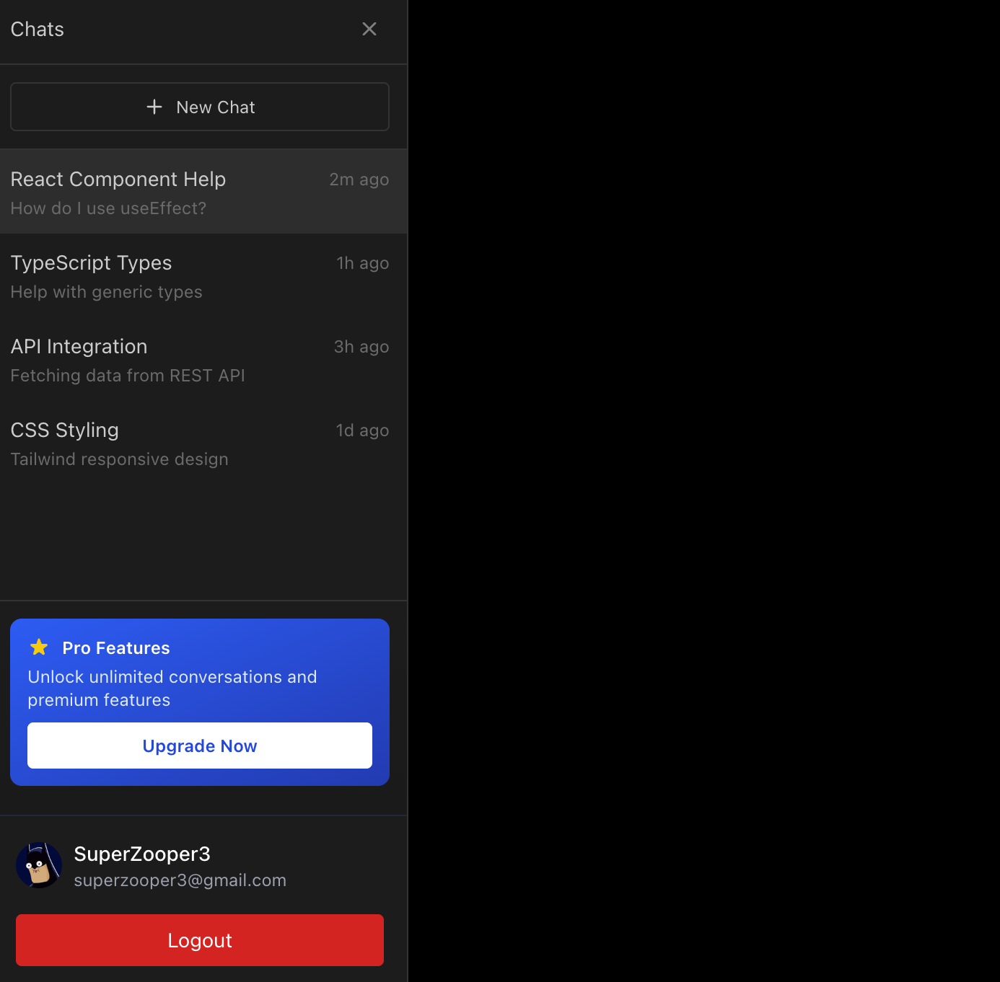

# 📱 Cursor on the Go!

**Ship code from anywhere. Literally anywhere.**

Control your Cursor IDE from your phone, tablet, or any device with a browser. Send prompts, watch responses stream in real-time, and keep your vibe coding flowing no matter where life takes you.

*HackUTD 2025 Project*

<p align="center">
  
  <br>
  <em>Beautiful mobile-first chat interface</em>
</p>


---

## ⚠️ SECURITY WARNING

**🚨 This is a hackathon project for educational purposes only! 🚨**

- This app can **execute arbitrary code** on your computer via Cursor's AI
- **Limited authentication or security** - exposing ports publicly = remote code execution risk
- Use only on **test machines** and **trusted networks**

**📄 [READ THE FULL DISCLAIMER](DISCLAIMER.md) BEFORE USING**

---

## 🎯 Inspiration

If you're a big fan of vibe coding like we are, you always want to keep the prompts flowing. But sometimes, life gets in the way! You need to go to the bathroom, talk to a colleague, get married, or any other situation in which it may not be appropriate to have a laptop, but you **STILL WANT TO SHIP**!

Well worry not! Our innovative new app lets you prompt Cursor from a mobile app and through your browser, watch its prompts flow back, and then follow up again with it! And once you're back at your computer, everything's perfectly in sync with your mobile session, ready to get back to work.

---

## ✨ What it does

- **🌐 Remote Control**: Connect to your Cursor instance from any device, send prompts and watch answers stream back in real-time
- **🔌 Easy Injection**: VSCode extension provides handy snippets to inject our client payload into Cursor's DevTools
- **🔔 Smart Notifications**: Get notified when your prompt is done processing (perfect for multitasking!)
- **🔐 Auth0 Integration**: Secure account management and authentication to keep your connections safe
- **💳 Stripe Payments**: Monetization ready (currently at $2 ARR, scaling to 100M! 🚀)
- **📱 Mobile-First UI**: Responsive design optimized for phones and tablets
- **⚡ Real-time Sync**: WebSocket-powered bidirectional communication

---

## 🏗️ Architecture

Cursor isn't designed for this kind of remote control, so we built a clever architecture:

```
┌─────────────────┐        WebSocket         ┌──────────────┐        WebSocket        ┌─────────────────┐
│   Mobile/Web    │ ◄─────────────────────► │ Relay Server │ ◄────────────────────► │ Cursor Desktop  │
│    Frontend     │     (HTTP + WS)          │  (FastAPI)   │     (Injected JS)      │   (Browser)     │
└─────────────────┘                          └──────────────┘                         └─────────────────┘
```

**Components:**
1. **Injection Payload**: JavaScript that runs in Cursor's DevTools, hooks into the DOM, monitors messages, and sends/receives via WebSocket
2. **Relay Server**: FastAPI backend that maintains WebSocket connections and relays messages between clients
3. **Frontend**: Next.js app with real-time chat interface, optimized for mobile
4. **VSCode Extension**: Helper extension to easily copy and inject the payload

---

## 🚀 Quick Start (5 Minutes)

### Prerequisites

- **Python 3.9+** (for relay server)
- **Node.js 18+** (for frontend)
- **Cursor IDE** (installed and running)

### 1️⃣ Start the Relay Server

```bash
cd relay-server

# Create virtual environment
python3 -m venv .venv
source .venv/bin/activate

# Install dependencies
pip install "fastapi[standard]" httpx websockets

# Start server
fastapi dev server.py
```

✅ Server should be running at `http://localhost:8000`

### 2️⃣ Start the Frontend

```bash
cd frontend

# Install dependencies
npm install

# Start development server
npm run dev
```

✅ Frontend should be running at `http://localhost:3000`

### 3️⃣ Inject Payload into Cursor

**Option A: Using VSCode Extension (Recommended)**

1. Open the `extension` folder in VS Code:
   ```bash
   cd extension
   npm install
   npm run compile
   cursor .
   ```

2. Press `F5` to launch Extension Development Host

3. In the new window, press `Cmd+Shift+P` (Mac) or `Ctrl+Shift+P` (Windows/Linux)

4. Type: **"Cursor Mobile Extension"** and select it

5. Click **"Open Cursor DevTools"** button (or manually: `Help → Toggle Developer Tools` in Cursor)

6. Copy the payload from the webview and paste into Cursor's Console tab (you may have to "allow pasting" in the console)

**Option B: Manual Injection**

1. In Cursor: **Help → Toggle Developer Tools**
2. Go to **Console** tab
3. Open `injection/fullPayload.js` and copy entire contents
4. Paste into console and press Enter

**Expected Output:**
```
🚀 Cursor Mobile: found X existing message(s)
👁️ Watching for new messages...
🌐 Relay server: http://localhost:8000
📝 Session ID: cursor-desktop-session
✅ WebSocket connected
✅ Sent via WebSocket: startup
```

### 4️⃣ Test It!

1. Open `http://localhost:3000` in your browser
2. You should see the chat interface
3. Type a prompt like "what is 2+2?" and press Enter
4. Watch as Cursor processes it and streams the response back!


---

## 📱 Mobile Access Setup

### Option 1: Local Network (Easiest) ⭐

Perfect for demos and testing when your phone and computer are on the same WiFi.

**Step 1: Find your computer's local IP**
```bash
# On Mac/Linux
ipconfig getifaddr en0

# On Windows
ipconfig
# Look for "IPv4 Address" under your WiFi adapter
```

Example output: `192.168.1.5`

**Step 2: Start services with network binding**

Terminal 1 - Backend:
```bash
cd relay-server
source .venv/bin/activate
fastapi dev server.py --host 0.0.0.0 --port 8000
```

Terminal 2 - Frontend:
```bash
cd frontend
npm run dev -- -H 0.0.0.0 -p 3000
```

**Step 3: Access from your phone**

Open your phone's browser and go to:
```
http://192.168.1.5:3000
```
(Replace `192.168.1.5` with YOUR computer's IP)

**That's it!** The frontend auto-detects the backend at `ws://192.168.1.5:8000` 🎉

<p align="center">
  
  <br>
  <em>Chat interface running on mobile - code anywhere! 📱</em>
</p>

### Option 2: ngrok (Works Anywhere)

Use when you're not on the same WiFi or want to demo remotely.

**Step 1: Install ngrok**
```bash
brew install ngrok
# Or download from https://ngrok.com/download
```

**Step 2: Start services normally**
```bash
# Terminal 1 - Backend
cd relay-server
source .venv/bin/activate
fastapi dev server.py

# Terminal 2 - Frontend
cd frontend
npm run dev
```

**Step 3: Create ngrok tunnels**
```bash
# Terminal 3 - Backend tunnel
ngrok http 8000

# Terminal 4 - Frontend tunnel
ngrok http 3000
```

You'll get URLs like:
- Backend: `https://abc123.ngrok-free.app`
- Frontend: `https://xyz789.ngrok-free.app`

**Step 4: Configure backend URL**

Open the frontend URL in your browser, then in the JavaScript console:
```javascript
__setBackendUrl("wss://abc123.ngrok-free.app")
```
(Use `wss://` for secure WebSocket over HTTPS)

Reload the page and you're connected! 🚀

---

## 📂 Project Structure

```
cursormobile/
├── extension/               # VSCode extension for easy payload injection
│   ├── src/
│   │   ├── extension.ts    # Extension entry point
│   │   └── ui/
│   │       └── webview.ts  # Webview with copy buttons
│   ├── package.json
│   └── README.md
│
├── injection/              # JavaScript payloads for Cursor
│   ├── fullPayload.js     # Complete WebSocket + monitoring (USE THIS)
│   ├── payload.js         # Original monitoring only
│   └── InjectAndSend.js   # Original injection helper
│
├── relay-server/          # FastAPI backend
│   ├── server.py          # Main relay server
│   ├── cli_client.py      # Python CLI client for testing
│   └── README.md
│
├── frontend/              # Next.js web app
│   ├── app/
│   │   ├── components/    # React components
│   │   │   ├── ChatInterface.tsx
│   │   │   ├── ChatMessages.tsx
│   │   │   ├── ChatInput.tsx
│   │   │   ├── CodeBlock.tsx
│   │   │   └── ...
│   │   ├── hooks/
│   │   │   └── useWebSocket.ts  # WebSocket management
│   │   ├── lib/
│   │   │   └── config.ts        # Auto backend URL detection
│   │   ├── api/           # API routes (Auth0, Stripe)
│   │   └── chat/
│   │       └── page.tsx   # Main chat page
│   ├── public/
│   │   ├── manifest.json  # PWA manifest
│   │   └── sw.js          # Service worker
│   ├── package.json
│   └── README.md
│
└── docs/                  # Documentation
    ├── QUICKSTART.md
    ├── NGROK.md
    ├── AUTH0_INTEGRATION_SUMMARY.md
    ├── PWA_SETTINGS_TROUBLESHOOTING.md
    └── ...
```

---


## Environment Variables

**Frontend** (create `.env.local`):
This is needed to enable Stripe payments and Auth0 authentication.
```bash
NEXT_PUBLIC_RELAY_SERVER_URL=ws://localhost:8000

# Optional: Auth0
AUTH0_SECRET=your_secret
AUTH0_BASE_URL=http://localhost:3000
AUTH0_ISSUER_BASE_URL=https://your-tenant.auth0.com
AUTH0_CLIENT_ID=your_client_id
AUTH0_CLIENT_SECRET=your_client_secret

# Optional: Stripe
NEXT_PUBLIC_STRIPE_PUBLISHABLE_KEY=pk_test_...
STRIPE_SECRET_KEY=sk_test_...
NEXT_PUBLIC_STRIPE_PRICE_ID=price_...
```

**Backend**: No configuration needed! Server uses sensible defaults.

---

## 🧪 Testing & Development

### Test with CLI Client

The CLI client is perfect for testing the relay server without the frontend:

```bash
cd relay-server
source .venv/bin/activate
python cli_client.py
```

**Interactive Mode:**
```
💬 You: what is 2+2?
🤖 Cursor: 2+2 equals 4.

💬 You: history        # View message history
💬 You: exit          # Quit
```

### Reload Payload

No need to restart Cursor! Just paste `fullPayload.js` again - it automatically cleans up previous instances.

---

## 🏗️ How We Built It

Cursor isn't designed for remote control, so we got creative:

### 1. JavaScript Injection Payload
The core innovation is `fullPayload.js`, which:
- **Hooks into Cursor's DOM**: Finds and monitors the chat container using MutationObserver
- **Extracts Messages**: Parses AI responses including code blocks, thinking blocks, and todos
- **WebSocket Connection**: Establishes persistent connection to relay server
- **Bidirectional Communication**: 
  - Receives prompts from server → injects into Cursor UI
  - Detects new responses → sends back to server
- **Smart Stabilization**: Waits 2 seconds after last change before sending (prevents partial responses)

### 2. Relay Server (FastAPI)
- **WebSocket Hub**: Maintains connections from both Cursor payload and frontend clients
- **Session Management**: Tracks prompts and responses per session
- **Message History**: Stores conversation for retrieval
- **Broadcast System**: Pushes messages to all connected clients in real-time

### 3. Mobile-First Frontend (Next.js)
- **Real-time Chat UI**: WebSocket-powered interface with auto-reconnection
- **Code Block Rendering**: Syntax highlighting, copy buttons, collapse/expand
- **Smart URL Detection**: Auto-detects backend URL based on environment (localhost, local IP, ngrok)
- **PWA Support**: Installable as app on iOS/Android with notifications
- **Responsive Design**: Optimized for phones, tablets, and desktop

### 4. VSCode Extension
- **Quick Access**: Command palette integration
- **Auto DevTools**: Opens Cursor DevTools automatically
- **Copy Helper**: Pre-formatted snippets with one-click copy

---

## 💪 Challenges We Overcame

**Integrating with Cursor**: No official API, so we had to:
- Reverse-engineer the DOM structure to find message elements
- Figure out how to programmatically "send" messages (simulate clicks, events, etc.)
- Extract code snippets from complex nested DOM structures
- Handle dynamic content updates with MutationObserver

**Real-time Sync**: Ensuring messages flow correctly:
- Race conditions between multiple WebSocket connections
- Message deduplication when Cursor updates responses
- Handling connection drops and auto-reconnect
- 2-second stabilization to avoid partial messages

**Mobile Experience**: Making it work seamlessly on phones:
- Dynamic viewport height handling (browser address bars)
- iOS safe area support (notches, home indicators)
- Auto-detecting backend URL based on network environment
- Responsive design that works on tiny screens

---

## 🎉 Accomplishments We're Proud Of

**It actually works!** This was way harder than we initially thought, but that moment when we sent a prompt from a phone and watched Cursor respond was pure magic.

We've built something we genuinely want to use every day. The ability to keep conversations flowing no matter where we are is genuinely useful.

---

## 📚 What We Learned

**Shipping code is awesome. Now you can do it everywhere.**

On a serious level, we learned:
- **Integration without APIs**: How to work with systems that don't want to be integrated with
- **Real-time Architecture**: Building robust WebSocket systems with reconnection, error handling, and state sync
- **Mobile-First Design**: Creating responsive UIs that work beautifully on phones
- **Developer Tools**: Deep dive into browser DevTools, DOM manipulation, and injection techniques
- **Appreciation for Open APIs**: This would've been 100x easier with an official API!

---

## 🚀 What's Next for Cursor on the Go!?

- **100M ARR** (currently at $2!)
- **YC X26** application
- Native iOS/Android apps
- Multi-user collaboration (share sessions)
- Voice input for hands-free prompting
- Streaming responses (word-by-word instead of waiting)
- Context awareness (file tree, open files)
- Prompt history and favorites
- Dark/light theme toggle

<p align="center">
  
  <br>
  <em>Give us more money!</em>
</p>

---

## 🙏 Acknowledgments

- Built at **HackUTD 2025**
- Powered by **Cursor IDE** (ironically)
- Thanks to the amazing hackathon organizers and mentors

---

## 💡 Tips & Tricks

**🔥 Hot Reload**: Paste `fullPayload.js` multiple times to reload without restarting Cursor

**📊 Debug Logs**: Check all three consoles:
1. Cursor DevTools (injection payload logs)
2. Relay server terminal (backend logs)
3. Frontend browser console (client logs)

**⚡ Fast Testing**: Use CLI client (`cli_client.py`) for quick backend tests without frontend

**📱 iOS PWA**: Add to Home Screen for full-screen app experience with notifications

**🌐 Remote Demo**: Use ngrok to show off your setup from anywhere

---

**Happy vibe coding! Ship from anywhere. 🚀📱**

---

## ⚖️ Security & Legal

**⚠️ IMPORTANT: READ BEFORE USING ⚠️**

This application is **EXTREMELY RISKY** and for **educational/hackathon purposes ONLY**.

### Key Risks

By using this software, you understand that:

- 🔓 **This app can execute arbitrary code on your computer** through Cursor's AI
- 🌐 **Forwarding ports publicly exposes your system to the internet** - anyone with your IP/ngrok URL could potentially send commands
- 🔒 **There is NO authentication or security by default** on the relay server
- 💣 **This is full of potential security vulnerabilities** - it was built in a hackathon, not for production use
- 🎯 **This gives web access to your terminal** if you forward ports - essentially opening your computer to remote code execution
- ⚠️ **AI can and will run commands, install packages, modify files, etc.** - all on your real system

### Safe Usage Guidelines

**DO NOT:**
- ❌ Run this on a production machine
- ❌ Forward ports publicly without understanding the risks
- ❌ Use this with sensitive data or on important systems
- ❌ Leave this running unattended
- ❌ Use this in any environment where security matters

**ONLY USE THIS:**
- ✅ On a throwaway/test machine or VM
- ✅ On a trusted local network
- ✅ For demos and experimentation
- ✅ With full understanding of the risks

### Legal Disclaimer

This software is provided "AS IS" with **NO WARRANTY** and **NO LIABILITY**. You use it entirely at your own risk.

**📄 [READ THE COMPLETE LEGAL DISCLAIMER](DISCLAIMER.md)**

By using this software, you acknowledge that you have read, understood, and accepted all terms in the full disclaimer.

---

*Built with ❤️ and way too much laughter*
